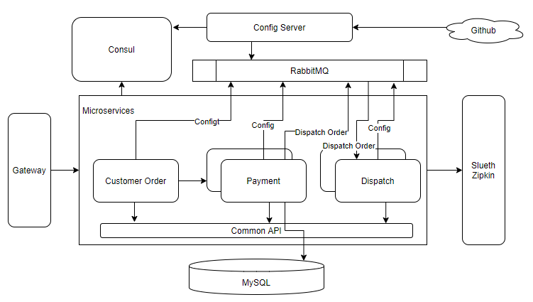

# Spring Stack Example

* Project Architecture



## Consul  -- service register and discovery center

Automate network configurations, discover services, and enable secure connectivity across any cloud or runtime.

### The key features of Consul

* Service Discovery: Clients of Consul can register a service, such as api or mysql, and other clients can use Consul to discover providers of a given service. Using either DNS or HTTP, applications can easily find the services they depend upon.
* Health Checking: Consul clients can provide any number of health checks, either associated with a given service ("is the webserver returning 200 OK"), or with the local node ("is memory utilization below 90%"). This information can be used by an operator to monitor cluster health, and it is used by the service discovery components to route traffic away from unhealthy hosts.
* KV Store: Applications can make use of Consul's hierarchical key/value store for any number of purposes, including dynamic configuration, feature flagging, coordination, leader election, and more. The simple HTTP API makes it easy to use.
* Secure Service Communication: Consul can generate and distribute TLS certificates for services to establish mutual TLS connections. Intentions can be used to define which services are allowed to communicate. Service segmentation can be easily managed with intentions that can be changed in real time instead of using complex network topologies and static firewall rules.
* Multi Datacenter: Consul supports multiple datacenters out of the box. This means users of Consul do not have to worry about building additional layers of abstraction to grow to multiple regions.

### Docker Setup & Test

```bash
> docker pull consul
> docker run --name some-consul -p 8500:8500 --net spring-cloud-dev-network --restart always -d consul
```

### Test

Open browser and go to http://localhost:8500 , this will show the Consul UI. 

## Microservices

Micro service includes muiltiple components from Spring framework

### Openfeign  -- Load Balancer

* Feign is a declarative web service client. 
* It makes writing web service clients easier. 
* To use Feign create an interface and annotate it. 
* It has pluggable annotation support including Feign annotations and JAX-RS annotations. 
* Feign also supports pluggable encoders and decoders.

### Hystrix  -- Circuit Breaker

* A typical distributed system consists of many services collaborating together.
* These services are prone to failure or delayed responses. If a service fails it may impact on other services affecting performance and possibly making other parts of application inaccessible or in the worst case bring down the whole application.

### Gateway

Spring Cloud Gateway aims to provide a simple, yet effective way (non-blocking) to route to APIs and provide cross cutting concerns to them such as: security, monitoring/metrics, and resiliency.

Three core concepts
* Route: The basic building block of the gateway. It is defined by an ID, a destination URI, a collection of predicates, and a collection of filters. A route is matched if the aggregate predicate is true.
* Predicate: This is a Java 8 Function Predicate. The input type is a Spring Framework `ServerWebExchange`. This lets you match on anything from the HTTP request, such as headers or parameters.
* Filter: These are instances of Spring Framework `GatewayFilter` that have been constructed with a specific factory. Here, you can modify requests and responses before or after sending the downstream request.

## Config and Bus

### Config
Spring Cloud Config provides server-side and client-side support for externalized configuration in a distributed system. 
* With the Config Server, you have a central place to manage external properties for applications across all environments. 
* The concepts on both client and server map identically to the Spring Environment and PropertySource abstractions, so they fit very well with Spring applications but can be used with any application running in any language. 
* As an application moves through the deployment pipeline from dev to test and into production, you can manage the configuration between those environments and be certain that applications have everything they need to run when they migrate. 
* The default implementation of the server storage backend uses git, so it easily supports labelled versions of configuration environments as well as being accessible to a wide range of tooling for managing the content. 
* It is easy to add alternative implementations and plug them in with Spring configuration.

### Bus

Spring Cloud Bus links nodes of a distributed system with a lightweight message broker. This can then be used to broadcast state changes (e.g. configuration changes) or other management instructions. AMQP and Kafka broker implementations are included with the project. Alternatively, any Spring Cloud Stream binder found on the classpath will work out of the box as a transport.

Here we use RabbitMQ, docker command

```bash
docker run --name spring-cloud-rabbitmq --net spring-cloud-dev-network -p 5672:5672 -p 15672:15672 -d rabbitmq:3-management
```

## Stream

Spring Cloud Stream is a framework for building highly scalable event-driven microservices connected with shared messaging systems. It feels like JDBC, Hibernate.
The framework provides a flexible programming model built on already established and familiar Spring idioms and best practices, including support for persistent pub/sub semantics, consumer groups, and stateful partitions.

## Sleuth

Spring Cloud Sleuth provides Spring Boot auto-configuration for distributed tracing. Each service invoking chain has a unique trace ID and span ID. 

### Zipkin
Zipkin is a distributed tracing system. It helps gather timing data needed to troubleshoot latency problems in service architectures. Features include both the collection and lookup of this data.
Run Zipkin in docker
```bash
docker run --name spring-cloud-zipkin --net spring-cloud-dev-network -p 9411:9411 -d openzipkin/zipkin
```
